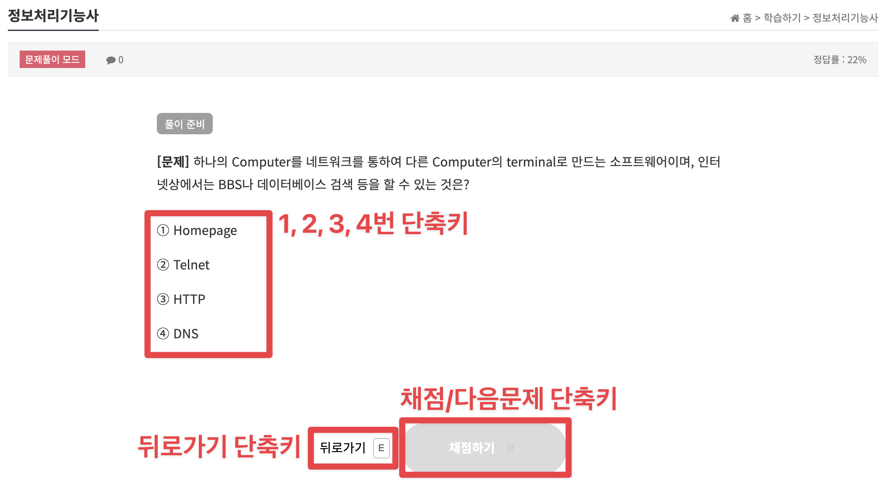

# 기출넷 속성암기 단축키

기출넷(rlcnf.net)에서 속성암기 기능 이용 시 단축키를 사용할 수 있게 해주는 스크립트입니다.

## 사용법

- 키보드 `1`, `2`, `3`, `4`번을 눌러 보기를 선택할 수 있습니다.
- 키보드 `E`를 눌러 뒤로 갈 수 있습니다.
- 키보드 `R`을 눌러 채점하고, 다시 눌러 다음 문제로 갈 수 있습니다.
  - 속성암기 모드일 때는 한 번만 누르면 다음 문제로 갑니다.

## 설치하는 법

> 이 프로그램은 UserScript입니다. Tampermonkey나 이에 준하는 UserScript 확장을 설치해야만 사용할 수 있습니다.

1. Tampermonkey 확장을 설치
   - [이 링크](https://chromewebstore.google.com/detail/tampermonkey/dhdgffkkebhmkfjojejmpbldmpobfkfo?hl=ko)에서 설치하실 수 있습니다.
2. 확장 프로그램 개발자 모드 ON
   - Chrome은 [이 링크](chrome://extensions/)에서
   - Edge는 [이 링크](edge://extensions/)에서
   - "개발자 모드" 스위치를 켜주시면 됩니다.
   - [왜 켜야 하나요?(영문)](https://www.tampermonkey.net/faq.php?locale=en#Q209)
3. 이 스크립트 설치
   - [이 링크](https://greasyfork.org/en/scripts/549136-%EA%B8%B0%EC%B6%9C%EB%84%B7-%EC%86%8D%EC%84%B1%EC%95%94%EA%B8%B0-%EB%8B%A8%EC%B6%95%ED%82%A4)에서 `Install this script` 버튼 클릭
4. 설치 완료!
